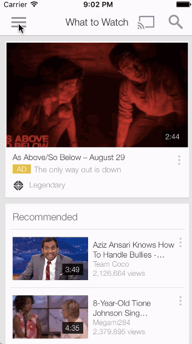

# W4 Lab: *Youtube*

[Instructions](http://courses.codepath.com/courses/ios_for_designers/unit/4#!exercises)

[Assets](https://www.dropbox.com/s/c32ukw116e2rao5/YouTube%20Assets.zip?dl=0)

**Youtube** has been programmatically animated with Swift (iOS).

Purpose of this week: implement custom navigation beyond the standard tab and navigation controllers. Hamburger navigation, sliding drawers, and custom tab bars are just a few of the examples of custom navigation.
By the end of this week, you should be able to implement custom navigation that you can find in YouTube, AirBnb, and Paper. The homework this week is to implement the Tumblr custom tab bar navigation.

Submitted by: [Sophia Kecir Camper](https://github.com/sophiakc)

Total time spent: **** cumulated hours

## Required User Stories
1. Setup:
	* [X] Create a new project and disable Auto Layout.
	* [X] Add the image assets above.
2. MenuViewController and FeedViewController
	* [X] Create view controllers for the MenuViewController and the FeedViewController
3. HamburgerViewController
	* [X] Create a view controller for the HamburgerViewController
	* [ ] In the Storyboard, add a view that will contain the menu and a view that will contain the feed. Create outlets for both these views.
	* [ ] Declare two properties for a MenuViewController and a FeedViewController (same place you put the outlets)
		var menuViewController: UIViewController!
	var feedViewController: UIViewController!
	* [ ] In viewDidLoad,
		* [ ] programmatically create new view controller copies of the menu and the feed view controllers
		* [ ] Add the view controllers the menu view and the feed view, respectively. Adding Child View Controllers. NOTE: The example in the guide wraps the code in a function for ease of reuse, however you can also just implement the code from the body of the function in the viewDidLoad()
4. Draggable Feed
	* [ ] Add a pan gesture recognizer to the view that contains the feed to reveal the MenuViewController.
	* [ ] Upon gesture ended, use the velocity to determine if the menu should be fully revealed or hidden.

## Optional User Stories: Bonus
5. Bonus: Menu scaling
	* [ ] When the menu is first revealed, it should be at scale 0.9.
	* [ ] As more of the menu is revealed, it should scale to 1.0.
	* [ ] Using View Transforms
6. Alternate bonus: AirBnb rotating menu effect
	* [ ] As the feed reveals the menu, the feed should rotate around the y axis.
	* [ ] Consider changing the menu for a series of labels like the AirBnB menu
	* [ ] Guide: Using Perspective Transforms
7. Bonus: Menu selection
	* [ ] Upon clicking on different menu items, show different view controllers in the content area.

## Video Walkthrough

## Notes / Challenges encountered while building the app:

## License

    Copyright [2016] [Sophiakc.com](http://www.sophiakc.com)

    Licensed under the Apache License, Version 2.0 (the "License");
    you may not use this file except in compliance with the License.
    You may obtain a copy of the License at

        http://www.apache.org/licenses/LICENSE-2.0

    Unless required by applicable law or agreed to in writing, software
    distributed under the License is distributed on an "AS IS" BASIS,
    WITHOUT WARRANTIES OR CONDITIONS OF ANY KIND, either express or implied.
    See the License for the specific language governing permissions and
    limitations under the License.
